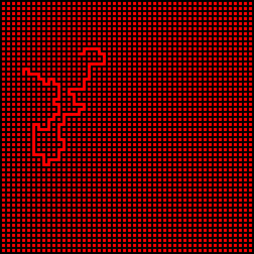
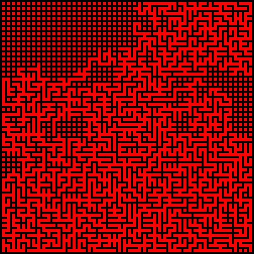

# clojure-programming-wilson

If you came to wonder while reading Clojure Programming, how exactly the book's version of the Wilson's Maze was different from the original algorithm. Well, here is my test leiningen project that happends to include that.

## Usage

lein run USEWILSON

         USEWILSON = true  (Wilson's algorithm)
                     false (Clojure Programming variant)

### Wilson's Maze Algorithm, one iteration 

### Book Variant, one iteration

## License

The source is modified from the book Clojure Programming examples and is distributed with the same license as it uses, the Eclipse Public License.
